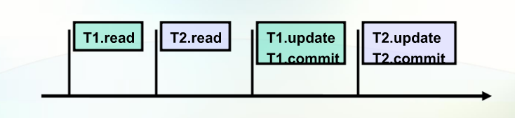
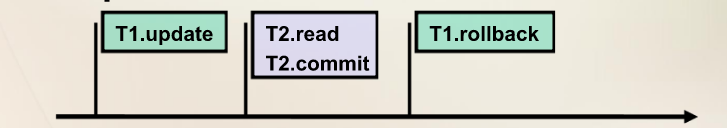
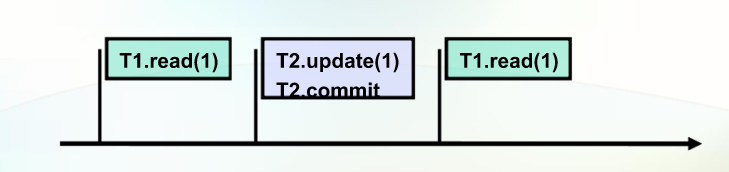
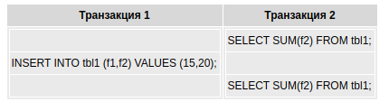
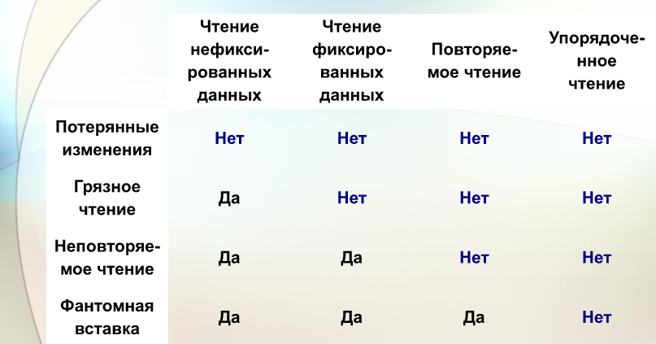

# Заметки про базы данных

## Транзакции (на примере JPA) 

#### Вопросы
1. Понятие и свойства транзакицй;
2. Управление транзакциями в JPA;
3. Уровни изоляций транзакий;
4. Стратегии блокировки;
5. Бизнес-трнзакции.

### Понятие и свойства транзакицй

**Транзакция** - это ограниченный набор действий, с явно определенными начальной и завершающей операцией, который либо выполняется целиком, либо не выполняется вовсе.

**Свойства транзакций (ACID)**: 
1. Atomicity (атомарность) - в контексте набора действий выполняются либо все действия, либо ни одного;
2. Consistency (согласованность) - системные ресурсы должны пребывать в целостном и не противоречивом состоянии, транзакция не должна ничего испортить;
3. Isolation (изолированность) - до момента фиксаций одной транзакции, данные не должны быть доступны другим для изменения;
4. Durability (устойчивость) - результат выполнения транзакции не должен быть утрачен ни при каких обстоятельствах. То есть, транзакция завершилась - данные изменились и никак иначе.

Эти свойства могут настраиваться. 
Чаще всего настраивается Isolation. 

### Анамалии транзакций
 
 Настраиваются изменением уровня изоляции. 
1. Потерянные изменеия - при отсутствии уровня изоляции

Две транзакции одновременно читают, потом пишет одна, затем вторая, изменения первой теряются.

2. Грязное чтение - когда транзакция начинает читать данные, которые не были подтверждены предыдущей.

Первая транзакция обновляет данные. Если при этом она разрешает читать данные другой, то вторая читает. При этом, первая
решила откатить изменения назад. А вторая прочитала уже то, что называется "грязные данные". 

3. Неповторяемое чтение - первая транзакция читает, вторая читает и сразу же меняет, первая транзакция еще раз читает и 
получает уже другие (измененные второй транзакцией) данные.

4. Фантомная вставка. 
 
Пусть имеется две транзакции. 

В транзакции 2 выполняется SQL-оператор, использующий все значения поля f2.
Затем в транзакции 1 выполняется вставка новой строки, приводящая к тому, что повторное выполнение 
SQL-оператора в транзакции 2 выдаст другой результат. 
Такая ситуация называется фантомной вставкой и является частным случаем неповторяющегося чтения. 
При этом, если выполняемый SQL-оператор выбирает не все значения поля f2, а только значение одной строки 
таблицы (используется предикат WHERE ), то выполнение оператора INSERT не приведет к ситуации фантомной вставки.
 
Типичный пример - внезапно поменялась цена товара на сайте. 

### Уровни исоляций транзакций

1. ISOLATION_READ_UNCOMMITTED (чтение нефиксированных данных) -  
2. ISOLATION_REPEATABLE_READ, 
3. ISOLATION_READ_COMMITTED, 
4. ISOLATION_SERIALIZABLE

Материал взят из [этой лекции](https://www.youtube.com/watch?v=4PKZRQAtf38)